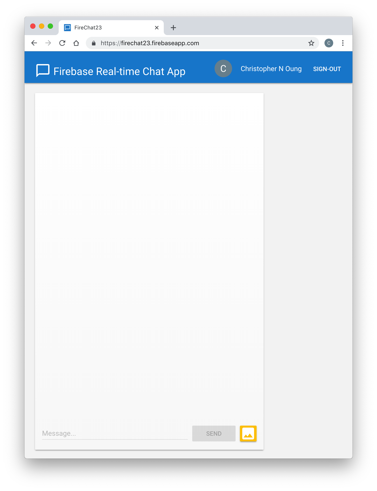

Firebase Real-Time Chat App
---------------------------
This document demonstrates how to connect to Firebase and use its complementary services to build and deploy a real-time chat client for the web. 

Live Preview
------------

Getting started
---------------
**Create a Firebase Project**

To create a Firebase project, follow these steps: 

1. On your computer, go to [console.firebase.google.com](), then click **Add project**

2. In the **Add a project** dialog box, complete the following tasks:
   
   a. In the **Project name** box, type your project name
   
   b. Clear the **Controller-controller terms** checkbox, then click **Create project**

License 
-------
© Chris Oung, 2018. Licensed under an [Apache-2](https://github.com/chrisoung/firebase-web/blob/master/LICENSE) license.

